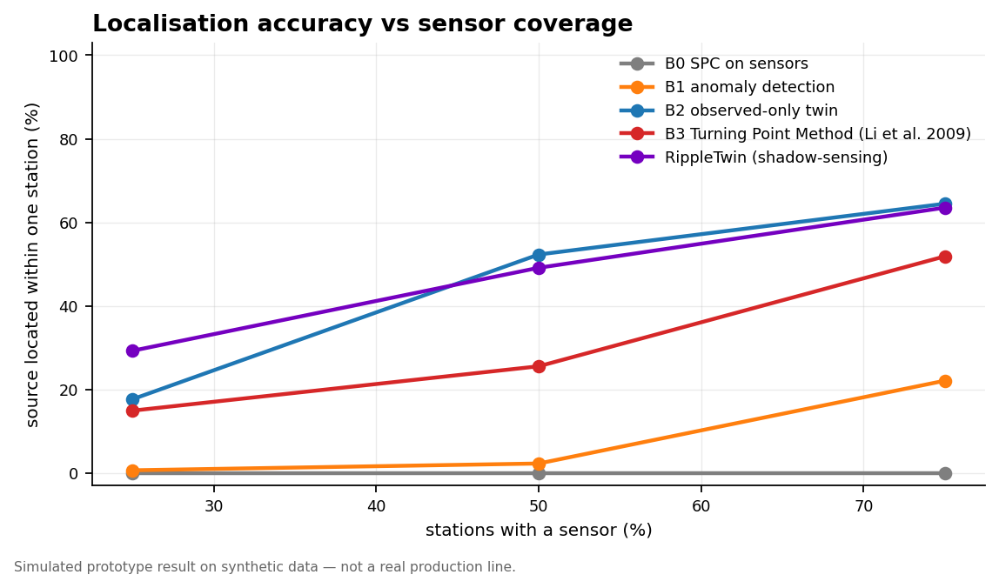
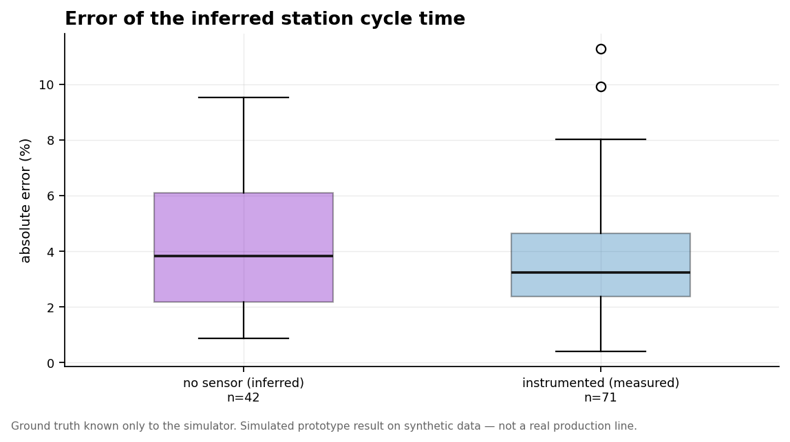
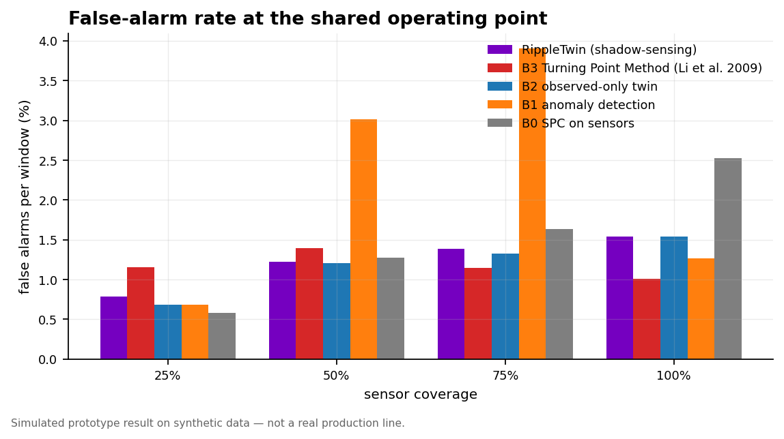

# Results

> **Every number on this page is a simulated prototype result on synthetic data.** No real production line was involved at any point. This document is generated by `python -m rippletwin.evaluation.report` directly from `results/tables/`, so it cannot drift from the evidence.

## Experimental setup

- **Line:** 42 stations across body construction, paint and final assembly; takt 60s; 76% of stations instrumented as configured
- **Held-out episodes:** 110 (plus 8 tuning episodes, split by seed)
- **Episode length:** 1200 vehicles
- **Nominal output rate:** 50.0 veh/h — this line loses ~17% of takt to ordinary blocking, starving and micro-stops, which is why shortfalls are measured against it rather than against takt
- **Operating point:** every method calibrated to a 1% per-window false-alarm target on held-out disturbance-free data, then run through an identical detection rule
- **Runtime:** 1790s

### Calibration per coverage level

| Coverage | Observed stations | Mean pairwise corr | Effective sample size | tau | Detection threshold |
|---|---|---|---|---|---|
| 100% | 42 | 0.292 | 3.23 | 0.0770 | 42.6 |
| 75% | 32 | 0.326 | 2.88 | 0.0901 | 31.3 |
| 50% | 21 | 0.288 | 3.10 | 0.1478 | 40.0 |
| 25% | 10 | 0.293 | 2.75 | 0.2750 | 23.9 |

Stations on a coupled line are strongly correlated. Treating them as independent observations inflates the evidence by roughly `1/tau`, and an uncorrected detector fires almost continuously.

---

## 1. Localisation when the faulty station has no sensor

This is the core claim. Episodes are flow faults (`SLOWDOWN`, `COMBINED`) whose source station emits **no telemetry** in that coverage view.

**Exact-station localisation, while the fault is active:**

| Sensor coverage | **RippleTwin** | B3 Turning Point (Li et al. 2009) | B2 observed-only twin | B1 anomaly detection | B0 SPC on sensors | episodes |
|---|---|---|---|---|---|---|
| 25% | 12% | 0% | 0% | 0% | 0% | 46 |
| 50% | 59% | 0% | 0% | 0% | 0% | 35 |
| 75% | 69% | 0% | 0% | 0% | 0% | 27 |

Every baseline scores **exactly zero**. Not badly — zero. Naming an un-instrumented station is outside what any of them can express.

### The comparison that matters: the published method

**B3 is the Turning Point Method** (Li, Chang & Ni, 2009) — the established data-driven bottleneck detection method that uses the very same blockage/starvation signal this project is built on. It is implemented in the strengthened deviation-scored form, which is *more* favourable to it than the published version, and calibrated to the same false-alarm rate as everything else.

| Coverage | TPM detects | RippleTwin detects | TPM exact | RippleTwin exact | TPM station error | RippleTwin station error |
|---|---|---|---|---|---|---|
| 25% | 65% | 65% | 0% | 12% | 6.5 | 3.0 |
| 50% | 74% | 63% | 0% | 59% | 4.8 | 2.3 |
| 75% | 78% | 78% | 0% | 69% | 3.6 | 2.0 |

**Read this table carefully, because it is not a rout.** The Turning Point Method detects these disturbances as reliably as we do, and at 50% coverage it detects *more* of them. It is a good method and it is doing its job. What it cannot do is name a station it cannot measure: it scans the stations it can see, so the turning point inside a sensor gap is outside its output space, and it lands on the first instrumented station past the gap.

On the flagship scenario, with a hidden fault at S02: the Turning Point Method detects in 122 windows and names **S03**; RippleTwin detects in 117 windows and names **S02**, correctly, in 88% of them.

**A fairness note.** The Turning Point Method was designed for steady-state analysis over substantial accumulation periods, not for detection in 20-vehicle windows, so this per-window regime is harsher than its intended use — which is why its full-coverage accuracy here is well below its reputation. That caveat does *not* apply to the 0% hidden-source result: that number is structural, and no window length changes it.

B2 is the other sharp comparison: it is RippleTwin's own model with hidden stations removed as candidates — same physics, same likelihood, same calibration — which isolates shadow-sensing itself from everything else we do.

**Localisation within one station** (a technician sent to an adjacent station will still find it):

| Sensor coverage | **RippleTwin** | B3 Turning Point (Li et al. 2009) | B2 observed-only twin | B1 anomaly detection | B0 SPC on sensors |
|---|---|---|---|---|---|
| 25% | 32% | 17% | 17% | 1% | 0% |
| 50% | 62% | 34% | 65% | 3% | 0% |
| 75% | 76% | 67% | 78% | 27% | 0% |



---

## 2. The control: at full coverage, the advantage disappears

At 100% sensor coverage there are no hidden stations, so shadow-sensing has nothing to contribute — and it contributes nothing:

- RippleTwin exact-station: **92.8%**
- Observed-only twin: **92.8%**

These are identical. We regard this as the most convincing single result in the evaluation: the advantage appears exactly and only where instrumentation is missing, which is what should happen if the mechanism is real rather than an artefact of tuning. A method that also won here would be telling us its gains came from somewhere else.

### All fault sources (instrumented and not)

| Sensor coverage | **RippleTwin** | B3 Turning Point (Li et al. 2009) | B2 observed-only twin | B1 anomaly detection | B0 SPC on sensors |
|---|---|---|---|---|---|
| 25% | 18% | 2% | 6% | 0% | 15% |
| 50% | 69% | 6% | 31% | 0% | 61% |
| 75% | 81% | 13% | 46% | 0% | 77% |
| 100% | 93% | 38% | 93% | 0% | 99% |

At high coverage SPC is a strong baseline, as it should be — if a station is instrumented and slows down, a control chart on its own cycle time will find it. The gap opens as coverage falls.

---

## 3. Estimating a cycle time that cannot be measured

The sharpest falsifiable claim in the project. For a station with no sensor, RippleTwin reads the departure rate of the first instrumented station downstream — which, while that station is the constraint, is set by the constraint itself. The simulator knows the true processing time, so the estimate is graded rather than asserted.

| Coverage | Source station | n | Median error | Mean abs error | Mean abs error (s) |
|---|---|---|---|---|---|
| 25% | instrumented | 2 | 7.7% | 7.7% | 6.7s |
| 25% | no sensor | 8 | 3.8% | 4.3% | 3.3s |
| 50% | instrumented | 10 | 4.0% | 4.3% | 3.4s |
| 50% | no sensor | 16 | 4.3% | 4.5% | 3.6s |
| 75% | instrumented | 19 | 3.2% | 3.9% | 3.0s |
| 75% | no sensor | 18 | 3.3% | 3.9% | 3.1s |
| 100% | instrumented | 40 | 3.0% | 3.5% | 2.7s |



Sample sizes are small — this is measured only on episodes where the fault was both a slowdown and confidently localised. We report `n` rather than rounding it out of sight.

---

## 4. Staying quiet

A detector that never stays quiet is worthless on a factory floor. All methods sit at a matched operating point, so these are comparable:

| Sensor coverage | **RippleTwin** | B3 Turning Point (Li et al. 2009) | B2 observed-only twin | B1 anomaly detection | B0 SPC on sensors |
|---|---|---|---|---|---|
| 25% | 0.79% | 1.16% | 0.68% | 0.68% | 0.58% |
| 50% | 1.22% | 1.40% | 1.20% | 3.02% | 1.27% |
| 75% | 1.38% | 1.14% | 1.32% | 3.90% | 1.63% |
| 100% | 1.54% | 1.01% | 1.54% | 1.27% | 2.53% |

Scenario-level behaviour on the named cases:

- **S3 normal variation** — 0 alerts. Mix changes, shift changes and micro-stops do not trigger it.
- **S5 mix change + inbound material delay** — attributed to `LINE_SUPPLY`, not to a station. A uniform starvation with no boundary is not a station fault, and the model has an explicit hypothesis for it.



---

## 5. Most of these faults never reach the production board at all

We had intended to headline warning lead time. The metric turned out to be badly under-powered, and the reason is the finding:

- Hidden-station flow faults examined: **27**
- Never produced a sustained line-level throughput shortfall: **21 (78%)**
- Of those invisible faults, RippleTwin localised: **57%**

A single station slowing on a 42-station line with decoupling buffers frequently never shows up as an aggregate shortfall — the buffers absorb it and the loss is real but diffuse. For those faults, lead time is not shorter. It is **undefined, because the alternative never arrives**.

This is a stronger claim than a lead-time number, and it is the one the evidence actually supports. Where the board *does* eventually register a shortfall, the sample is too small (single digits) for us to quote a reliable lead-time figure, so we do not.

---

## 6. The quality path

The flow model detects a **pure quality drift in 0% of windows** — correctly, because a station holding takt while producing bad work leaves no timing signature. The genealogy path handles that case.

- True source ranked in the top 3 of 42 candidates: **26%** of episodes
- Top 5: **42%**
- Median rank of the true source: **7 of 42**
- Estimated defect-rate multiplier: **7.9x** against a true injected **6.6x**
- False-alarm rate on clean episodes: **1.7%**

**This is a shortlist, not a verdict**, and we present it as one. Its value is narrowing 42 stations to a handful with a defensible reason, and estimating how far off-nominal the source is running. Note that these figures are identical at every coverage level: the quality path uses only inspection results and the build sequence, so it is unaffected by how many stations have sensors.

---

## 7. Where the next sensor should go

The obvious objection to this whole project is "why not just instrument the blind stations?". You should — but a plant retrofits during a handful of maintenance windows a year, so the real question is **which ones buy the most**. That falls out of the same model, and needs **no production data**, so it can be run before committing.

A blind station is locatable only if its predicted signature is distinguishable, using the stations we can see, from its neighbours'. Two blind stations side by side are not — and that is knowable in advance from the sensor layout alone.

| Priority | Station | Zone | Currently confusable | Value of information | Also helps resolve |
|---|---|---|---|---|---|
| 1 | S37 | FINAL | 97% | 1.54 | S38, S33, S35 |
| 2 | S32 | FINAL | 97% | 1.49 | S33, S37, S35 |
| 3 | S38 | FINAL | 97% | 1.48 | S37, S35, S33 |
| 4 | S33 | FINAL | 97% | 1.46 | S32, S37, S35 |
| 5 | S35 | FINAL | 85% | 1.00 | S33, S37, S32 |

### Does the theory predict where we actually struggle?

Correlation between predicted separability and measured exact-localisation rate, per source station: **r = 0.37** across 24 stations.

The four stations the metric rates least separable, and how the twin actually did on them:

| Station | Separability | Measured exact rate | episodes |
|---|---|---|---|
| S33 | 8.0 | 0% | 1 |
| S38 | 8.3 | 0% | 1 |
| S37 | 8.9 | 90% | 1 |
| S32 | 9.3 | 29% | 4 |

**Stated honestly: this is directional, not strong.** The correlation is modest and there are only a handful of episodes per source station, so it is evidence that the metric points the right way, not proof that it is well calibrated. What is clear-cut is the extreme: the stations it rates least separable are the adjacent blind pairs, and localisation on those collapses — which is exactly what the structural argument predicts and exactly where a sensor should go.

Ranked on **separability** — the residual left when the closest rival hypothesis is fitted to a station's response, in noise units — rather than on the more intuitive similarity score. Similarity is not monotone under adding sensors: a new observer that responds similarly to two rivals pulls their angle together, so a placement tool built on it can claim a sensor made things worse. Separability provably cannot (the change in squared residual reduces to a perfect square). A test pins both behaviours.

---

## 8. What these numbers do not show

- **No real-world validation.** Synthetic data throughout. The physics is faithful and the disturbances are plausible, but nothing here is evidence about a real plant.
- **Weak faults are genuinely hard.** Detection is averaged across magnitudes down to 1.14x. See `detection_by_magnitude.csv` rather than trusting an average.
- **Small samples in places.** Cycle-time inference and the visibility analysis rest on tens of episodes, not hundreds. `n` is reported everywhere.
- **The simulator is ours.** Mitigation: it broke two of our own designs (documented in `METHOD.md`), which a simulator built to flatter the method would not have done.
- **Serial-line assumption.** Parallel paths and rework loops need the propagation matrix rebuilt.
- **The placement metric is validated only directionally**, on few episodes per station.

---

## Reproducing

```bash
python -c "import sys;sys.path.insert(0,'src');from rippletwin.evaluation.experiments import run_experiment;run_experiment()"
python demo/make_figures.py
python -m rippletwin.evaluation.report
```

